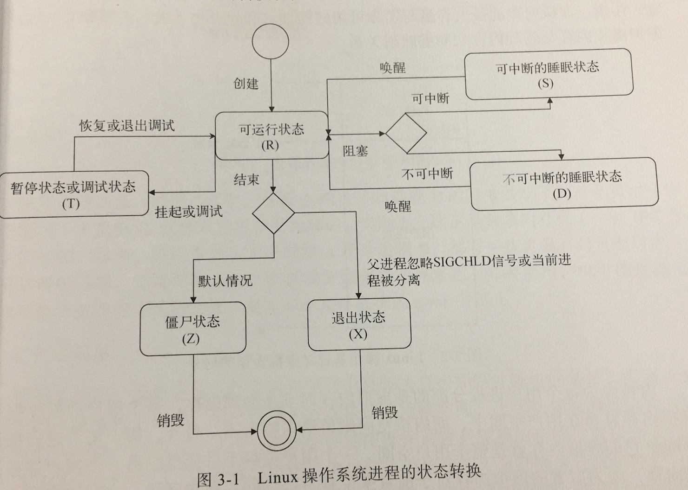

# Go并发编程实战

前两章都是对Go的基本语法的相关介绍，因为我已经熟悉Go的语法和使用，快速浏览一遍后，从第三章开始记录。

## 并发编程综述

并发编程是一种现代计算机编程技术。它的含义比较宽泛，可以是多线程编程，也可以是多进程编程。

并发编程的思想来源于多任务操作系统，它允许同时运行多个程序，当一个程序暂时不需要用到CPU时，系统会把该程序挂起或中断，以使其他程序可以使用CPU

**并发程序和并行程序**

并发程序是指可以被同时发起执行的程序，而并行程序则被设计成可以在并行的硬件上执行的并发程序

### 多进程编程

在多进程程序中，如果多个进程之间需要协作完成任务，那么进程间通信的方式就是需要重点考虑的事项之一。在中通信常被叫做IPC

在Linux下，从处理机制的角度看，可以分为三类：

* 基于通信的IPC方法

    * 数据传送为手段的IPC方法

        * 管道 pipe  可以传从字节流
        * 消息队列 message queue  可以用来传送结构化的消息对象

    * 共享内存为手段的IPC方法

        * 共享内存区

* 基于信号的IPC方法

    基于操作系统的信号（signal)机制

* 基于同步的IPC方法

    信号量

Go支持的IPC方法有管道、信号和socket

#### 进程

* 进程的衍生

    进程使用fork可以创建 若干个新的进程，关系为父子进程，每个子进程都是源自它的父进程的一个副本，他会获得父进程的**数据段、堆和栈的副本，并与父进程共享代码段**，每一份副本都是独立的，子进程对属于它的副本进行的修改，对其他进程是不可见的。

    全盘复制父进程的数据是一种相当低效的做法，Linux操作系统内核采用写时复制（COW)等技术来提高进程创建的效率。

    当然，刚创建的子进程也可以通过系统调用exec把一个新的程序加载到自己的内存中，而原先在其内存中的数据段、堆、栈以及代码段就会被替换掉，在这之后，子进程执行的就会是刚加载进来的新程序

* 进程的标识

    内核通过进程描述符来记录每个进程的属性和行为，包括进程的优先级、状态、虚拟地址范围和访问权限等

    保存在进程描述服符的进程ID(PID)，是进程在操作系统中的唯一标识，其中进程ID为1的进程就是之前提到的内核启动进程。PID是一个递增的方式，如果到达最大限制值时，会从头开始查找闲置的PID

    其中进程描述符中使用PPID，来表示父进程的PID

    ```
    pid := os.Getpid()
    ppid ;= os.Getppid()
    ```

* 进程的状态

    * 可运行状态
    * 可中断的睡眠状态
    * 不可中断的睡眠状态
    * 暂停状态或跟踪状态
    * 僵尸状态
    * 退出状态

    

* 进程的空间

    用户进程总会生存在用户空间中，但是不能与计算机的硬件直接交互。内核可以与计算机的硬件直接交互，它生存在内核空间中。用户进程无法直接访问内核空间。

    

    内存区域中的每一个单元都是有地址的，这些地址由指针来标识和定位，通过指针来寻找内存单元的操作叫做内存寻址

    这里说的地址并非物理内存中的真实地址，而是虚拟地址，而由虚拟地址来标识的内存区域又称为虚拟地址空间，有时候也称为虚拟内存。并且，虚拟内存的最大容量与实际可用的物理内存的大小无关。

    内核和CPU会负责维护虚拟内存和物理内存之间的映射关系。

    内核会为每个用户进程分配的是虚拟内存而不是物理内存，每个用户进程分配到的虚拟内存总是在用户空间中，而内核空间则留给内核专用。

    一个用户进程不可能操作另一个用户进程的虚拟内存，因为后者的虚拟内存对于前者来说是不可见的。进程的虚拟内存几乎是彼此独立、互不干扰的。因为它们基本上被映射到了不同的物理内存上

* 系统调用

    为了使用户进程能够使用操作系统更底层的功能，内核会暴露一些借口给它们使用，这些接口是用户进程实用哪壶功能(计算机硬件)的唯一手段，也是用户空间和内核空间的一座桥梁。

    用户进程使用这些接口的行为称为系统调用。系统调用一般也是通过函数实现的，但是它是向内核空间发出一个明确请求，而普通函数只是定义了如何获取一个给定的服务。系统调用会导致内核空间中数据的存取和指令的执行，而普通函数却只能在用户空间中有所作为。

    为了保证操作系统的稳定和安全，内核依据由CPU提供的、可以让进程驻留的特权级别建立了两个特权状态--内核态和用户态。再大部门时间里，CPU都处于用户态，这时CPU只能对用户空间进行访问，当用户进程发出一个系统调用的时候，内核会把CPU从用户态切换到内核态，而后让CPU执行对应的内核函数。当内核函数执行完毕之后，内核会把CPU从内核态切换到用户态

* socket

    socket，常译为套接字，也是一种IPC方法，但是与其他IPC方法不同的是，他可以通过网络连接让多个进程建立通信并互相传递数据，使得通信双方是否在同一个计算机上无关紧要

    Linux操作系统下，存在一个名为socket的系统调用

    `int socket(int domain, int type, int protocol)`

    接受的三个参数，分别代表这个socket的通信域、类型和所用协议

    每个sockey都必将存在于一个通信域中，而通信域决定了该socket的地址格式和通信范围

    通信域 | 含义 | 地址形式 | 通信范围
    --------- | -------------
    AF_INET | IPV4域 | IPV4地址 4字节，端口号 2字节 | 在基于IPV4协议的网络中任意两台计算机之上的应用程序
    AF_INET6 | IPV6域 | IPV6地址 16字节，端口号 2字节  | 在基于IPV6协议的网络中任意两台计算机之上的应用程序
    AF_UNIX | Unix域 | 路径名称  | 在同一台计算机上的两个应用程序

    AF的缩写指的是address family，意为地址族， IPV4 和 IPV6域的通信是在网络范围内的，而Unix域的通信则是在单台计算机的范围内的

    socket的类型有很多，包括`SOCK_STREAM SOCK_DGRAM SOCK_RAW以及针对某个新兴数据传输技术SOCK_SEQPACKET`

    ```
    -----------------------------------------------------------------
                       socket类型
       特性     ------------------------------------------------------
                SOCK_DGRAM   SOCK_RAW   SOCK_SEQPACKET   SOCK_STREAM
    -----------------------------------------------------------------
    数据形式       数据包       数据包        字节流            字节流
    数据边界       有            有           有               没有
    逻辑连接       没有          没有          有                有
    数据有序性     不能保证       不能保证      能保证           能保证
    传输可靠性     不具备         不具备        具备             具备
    ```

    数据形式有两种：

    * 数据报

        以数据报位数据形式意味着数据接收方的socket接口程序可以意识到数据的边界并会对它们进行切分，这样就省去了接收方的应用程序寻找数据边界和切分数据的工作量
    * 字节流

        以字节流为数据形式的数据传输实际上传输的是一个字节接着一个字节的串，可以把它想象成一个很长的字节数组，一般情况下，字节流并不能体现出哪些字节属于哪个数据包的，所以socket程序无法从中分离出独立的数据包。

    socket接口即可以提供网络中不同计算机上多个应用程序间的通信支持，也可以成为单台计算机上多个应用程序之间的通信手段

    

    Go的socket编程API程序在底层获取的是一个非阻塞式的socket实例，这意味着该实例上的数据读取操作也都是非阻塞式的，在应用程序试图通过调用read从socket的接收缓冲区中读取数据时，即使接收缓冲区中没有任何数据，操作系统内核也不会使系统调用read进行阻塞状态，而是直接返回一个错误码为EAGAIN的错误。

    但是应用程序并不应该将它看成一个真正的错误，而是忽略它，然后稍等过后再去尝试读取，如果读取数据的时候接收缓冲区有数据，那么系统调用read就会携带数据立刻返回，季氏当时的接收缓冲区只包含了一个字节的数据，也会这样，这个特性为部分读。

    同理，当应用程序试图向socket的发送缓冲区中写入一段数据，即使发送缓冲区满了，系统调用write也不会阻塞，而是返回一个EAGAIN的错误，等稍后再写入数据，并且返回已写入的字节的数据量，这一特性称为部分写。

    Go的socket编程API程序在一定程度上充当了前面说的应用程序的角色，为我们屏蔽了相关系统调用EAGAIN的错误，这使得有些socketAPI看起来是阻塞的，但是底层是用的非阻塞的socket接口。


* 管道

    管道(pipe)是一种半双工(或者说单向)的通信方式，只能用于父进程与子进程以及同祖先的子进程之间的通信

    管道的优点在于简单，而缺点则是只能单向通信以及对通信双方关系上的严格限制

    

    


