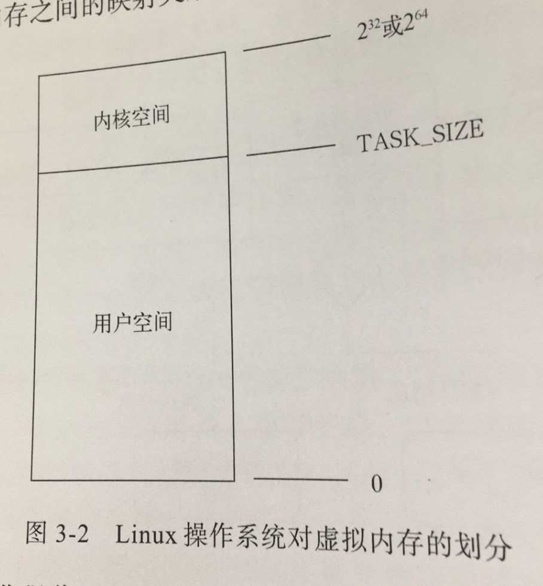

# Go并发编程实战

前两章都是对Go的基本语法的相关介绍，因为我已经熟悉Go的语法和使用，快速浏览一遍后，从第三章开始记录。

## 并发编程综述

并发编程是一种现代计算机编程技术。它的含义比较宽泛，可以是多线程编程，也可以是多进程编程。

并发编程的思想来源于多任务操作系统，它允许同时运行多个程序，当一个程序暂时不需要用到CPU时，系统会把该程序挂起或中断，以使其他程序可以使用CPU

**并发程序和并行程序**

并发程序是指可以被同时发起执行的程序，而并行程序则被设计成可以在并行的硬件上执行的并发程序

### 多进程编程

在多进程程序中，如果多个进程之间需要协作完成任务，那么进程间通信的方式就是需要重点考虑的事项之一。在中通信常被叫做IPC

在Linux下，从处理机制的角度看，可以分为三类：

* 基于通信的IPC方法

    * 数据传送为手段的IPC方法

        * 管道 pipe  可以传从字节流
        * 消息队列 message queue  可以用来传送结构化的消息对象

    * 共享内存为手段的IPC方法

        * 共享内存区

* 基于信号的IPC方法

    基于操作系统的信号（signal)机制

* 基于同步的IPC方法

    信号量

Go支持的IPC方法有管道、信号和socket

#### 进程

* 进程的衍生

    进程使用fork可以创建 若干个新的进程，关系为父子进程，每个子进程都是源自它的父进程的一个副本，他会获得父进程的**数据段、堆和栈的副本，并与父进程共享代码段**，每一份副本都是独立的，子进程对属于它的副本进行的修改，对其他进程是不可见的。

    全盘复制父进程的数据是一种相当低效的做法，Linux操作系统内核采用写时复制（COW)等技术来提高进程创建的效率。

    当然，刚创建的子进程也可以通过系统调用exec把一个新的程序加载到自己的内存中，而原先在其内存中的数据段、堆、栈以及代码段就会被替换掉，在这之后，子进程执行的就会是刚加载进来的新程序

* 进程的标识

    内核通过进程描述符来记录每个进程的属性和行为，包括进程的优先级、状态、虚拟地址范围和访问权限等

    保存在进程描述服符的进程ID(PID)，是进程在操作系统中的唯一标识，其中进程ID为1的进程就是之前提到的内核启动进程。PID是一个递增的方式，如果到达最大限制值时，会从头开始查找闲置的PID

    其中进程描述符中使用PPID，来表示父进程的PID

    ```
    pid := os.Getpid()
    ppid ;= os.Getppid()
    ```

* 进程的状态

    * 可运行状态
    * 可中断的睡眠状态
    * 不可中断的睡眠状态
    * 暂停状态或跟踪状态
    * 僵尸状态
    * 退出状态

    

* 进程的空间

    用户进程总会生存在用户空间中，但是不能与计算机的硬件直接交互。内核可以与计算机的硬件直接交互，它生存在内核空间中。用户进程无法直接访问内核空间。

    

    内存区域中的每一个单元都是有地址的，这些地址由指针来标识和定位，通过指针来寻找内存单元的操作叫做内存寻址

    这里说的地址并非物理内存中的真实地址，而是虚拟地址，而由虚拟地址来标识的内存区域又称为虚拟地址空间，有时候也称为虚拟内存。并且，虚拟内存的最大容量与实际可用的物理内存的大小无关。

    内核和CPU会负责维护虚拟内存和物理内存之间的映射关系。

    内核会为每个用户进程分配的是虚拟内存而不是物理内存，每个用户进程分配到的虚拟内存总是在用户空间中，而内核空间则留给内核专用。

    一个用户进程不可能操作另一个用户进程的虚拟内存，因为后者的虚拟内存对于前者来说是不可见的。进程的虚拟内存几乎是彼此独立、互不干扰的。因为它们基本上被映射到了不同的物理内存上

* 系统调用

    为了使用户进程能够使用操作系统更底层的功能，内核会暴露一些借口给它们使用，这些接口是用户进程实用哪壶功能(计算机硬件)的唯一手段，也是用户空间和内核空间的一座桥梁。

    用户进程使用这些接口的行为称为系统调用。系统调用一般也是通过函数实现的，但是它是向内核空间发出一个明确请求，而普通函数只是定义了如何获取一个给定的服务。系统调用会导致内核空间中数据的存取和指令的执行，而普通函数却只能在用户空间中有所作为。

    为了保证操作系统的稳定和安全，内核依据由CPU提供的、可以让进程驻留的特权级别建立了两个特权状态--内核态和用户态。再大部门时间里，CPU都处于用户态，这时CPU只能对用户空间进行访问，当用户进程发出一个系统调用的时候，内核会把CPU从用户态切换到内核态，而后让CPU执行对应的内核函数。当内核函数执行完毕之后，内核会把CPU从内核态切换到用户态


    

